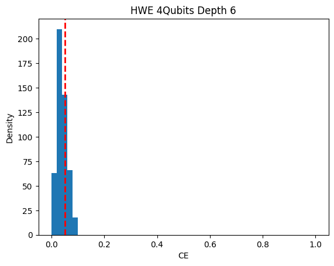

# ICEPP_summercamp2024

東京大学素粒子物理国際研究センター令和6年度ICEPP量子研究サマーキャンプ(<https://www.icepp.s.u-tokyo.ac.jp/collaboration/quantum-summercamp.html>)に参加した際に開発したコード

# 本リポジトリに含まれるコード

* 教師あり学習の2値分類タスクを行う量子機械学習モデルの量子データセット[NTangled Datasets](https://github.com/LSchatzki/NTangled_Datasets?tab=readme-ov-file#ntangled-datasets)の作成
* Ntangled Datasetsを利用した2種の量子機械学習モデルによるベンチマーク計測

## [NTangled Datasets](https://github.com/LSchatzki/NTangled_Datasets?tab=readme-ov-file#ntangled-datasets)の作成

二値分類を行うための教師付き量子データセット[NTangled Datasets](https://github.com/LSchatzki/NTangled_Datasets?tab=readme-ov-file#ntangled-datasets)を作成する.

ランダムな積状態に対し,[NTangled Datasetsのリポジトリ](https://github.com/LSchatzki/NTangled_Datasets?tab=readme-ov-file#ntangled-datasets)で示されているパラメータ付き量子回路を作用させることで,特定の[Concentratable Entropy(CE)](https://arxiv.org/abs/2104.06923)の値に近しい値を中心とする分布のエンタングル状態を作り出す.

[NTangled Datasetsのリポジトリ](https://github.com/LSchatzki/NTangled_Datasets?tab=readme-ov-file#ntangled-datasets)では,3種のパラメータ付き量子回路の構成とそのパラメータの値が与えられていた.

本リポジトリは,それらを利用した以下の機能を持つコードを含む.

* Ntangled Datasetsを作成するためのHardware Efficent(HWE)回路
* エンタングル状態のCEの値の分布の可視化
* データセットファイルの作成

### データセットの構成

#### 出力データ（ラベル）

出力データは,エンタングル状態のCEに対応する-1,1のラベルである.例として,回路を作用させてできるエンタングル状態のCEがそれぞれ0.05,0.35ならば,ラベルとしてそれぞれ-1,1を付与する.

#### 入力データ
入力データは,特定のCEの値を持つエンタングル状態であるが,エンタングル状態をそのまま扱うことは難しいため,入力データは,初期状態から積状態を作り出すための量子回路のパラメータである.入力データのパラメータと,初期状態から積状態,エンタングル状態を作りだす回路を利用して出力されるエンタングル状態が,量子機械学習モデルに対する入力となる.

## 2種の量子機械学習モデル
Ntangled Datasetsを用いて,機械学習を行う[StronglyEntagnlingLayers](https://docs.pennylane.ai/en/stable/code/api/pennylane.StronglyEntanglingLayers.html)と[Quantum Convolutional Neural Networks(QCNN)](https://www.tensorflow.org/quantum/tutorials/qcnn?hl=ja)の2種のモデルを含む.エポックごとの損失と,学習後のテストデータに対する正答率を出力する.
